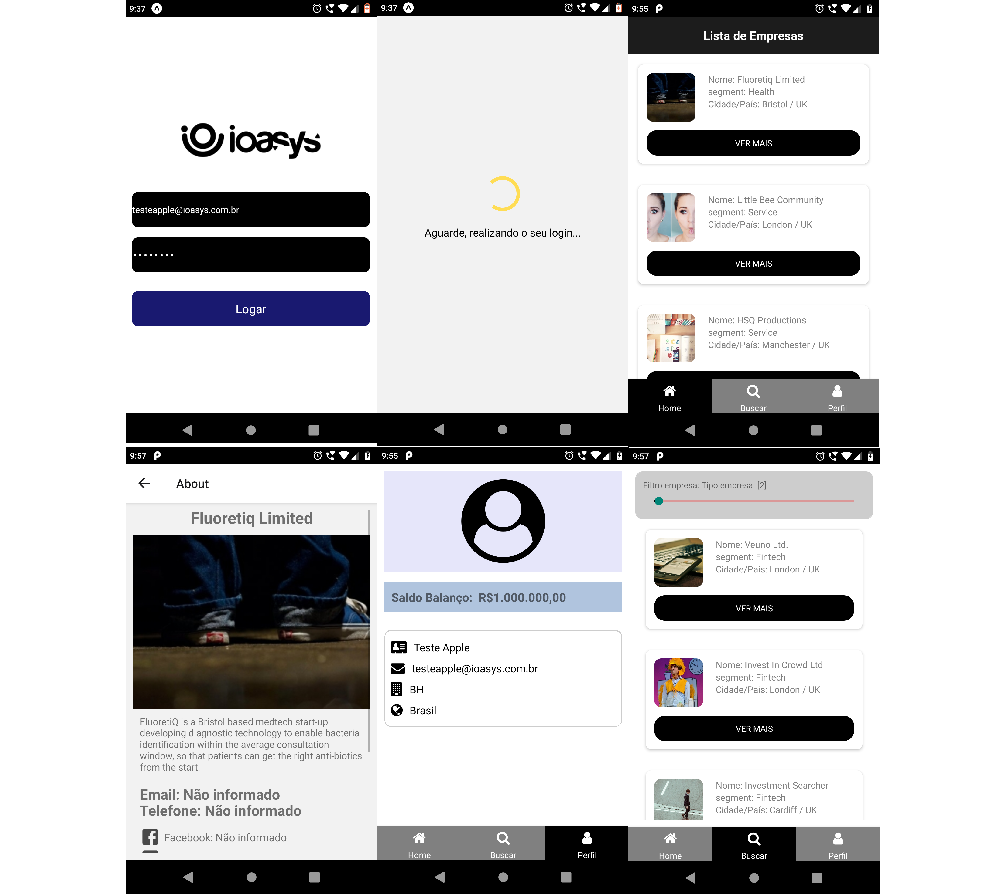

# Desafio React Native - ioasys by Alexandre carvalho marques

---

### Dependencias Utilizadas:

**Redux, React-Redux e Redux-Thunk**
- "react-redux": "^7.2.2",
- "redux": "^4.0.5",
- "redux-thunk": "^2.3.0",

**Outras Libs**

- "@react-native-community/async-storage": "^1.12.1",
- "@react-native-community/async-storage": "^1.12.1",
- "@react-native-community/masked-view": "^0.1.10",
- "react-native-gesture-handler": "^1.8.0",
- "react-native-intl": "^1.0.0",
- "react-native-reanimated": "^1.13.1",
- "react-native-safe-area-context": "^3.1.8",
- "react-native-screens": "^2.13.0",
- "react-native-unimodules": "~0.11.0",
- "axios": "^0.21.0",
- "@react-native-community/slider": "3.0.3"

**Navegação**

- "@react-navigation/bottom-tabs": "^5.11.0",
- "@react-navigation/native": "^5.8.8",
- "@react-navigation/stack": "^5.12.5",

**Perfumaria**

-  "react-native-vector-icons": "^7.1.0",
-  "styled-components": "^5.2.1",

## Passo a Passo

### Projeto

**Install**
- o projeto esta na segunite estrutura
- =>..: empresas-react-native => FrontEnd => MobileCompanies
- Clonar repositório e executar npm install ou yarn.
- O Projeto foi desenvolvido usando Bare WorkFlow.
- Podemos executar expo star ou  yarn star ou ainda react-native run-android.

### Aplicação

**SignIn / SingUp**

Na primeira tela do aplicativo é possivel se autenticar com e-mail e senha.
Não existe cadastro por falta de tempo mesmo.

**About**

Precionando o botão _Ver Mais_ temos acesso as informações inerente a empresa selecionada, como: Nome, Imagem, Descrição, Email, Telefone, Redes Sociais, Cidade, Pais e Segmento de atuação.

**Find**

Nesta pagina o usuario pode pesquisar por seguimento de atuação somente. Sendo localizada, mostrará um card com: Imagem, Nome da Empresa, Cidade, Pais e Segmento de atuação.

**Profile**

Tem acesso aos dados do usuario logado, como: Avatar, Nome, Email, Cidade, Pais, Investimentos, Saldo Disponivel e Total na Carteira.

## Funcionalidades Faltantes ou Inacabadas

Das solicitações feitas no desafio, todas são possiveis de serem acessadas dentro da aplição. Contudo uma funcionalidade que não terá o desempenho esperado é a listagem das empresas e filtro.

Com mais tempo, poderia ser implementado outras features e uma paginação no FlatList para não pesar a tela.

Existe um teste na pasta integration, mas apenas de forma para testar o login, a ideia era implementar alguns testes de integração e frontend.

## Pages

## Minhas palavras

Gostaria de agradecer a participação neste teste técnico, pois além de aprender muito, foi um ótimo termometro de como está meus conhecimentos nessa stack que amo, atualmente tenho trabalhado com as tecnologias ionic, Angular e .Net Core, mas amo mesmo mobile com native.

Se eu passar desta fase, será um prazer trabalhar com a equipe da empresa que só deve ter feras mesmo,
sem dúvida irei aprender muito, estudo muito diariamente novas tecnologias e tento me manter sempre atualizado, optei por usar redux e redux-thunk por não ter ainda dominio do redux-saga, mas já comecei a estudar.

Amo tecnologia e dividir conhecimento e principalmente mobile por conta de que muda a vida das pessoas com pequenas ou grandes ideias, conseguimos transformar a vida de alguém.

Alexandre carvalho marques..
